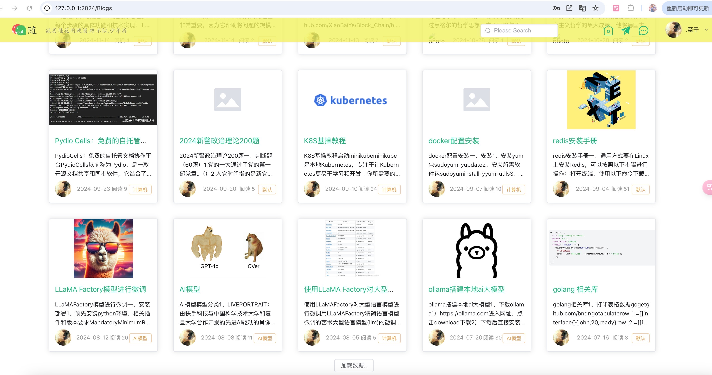
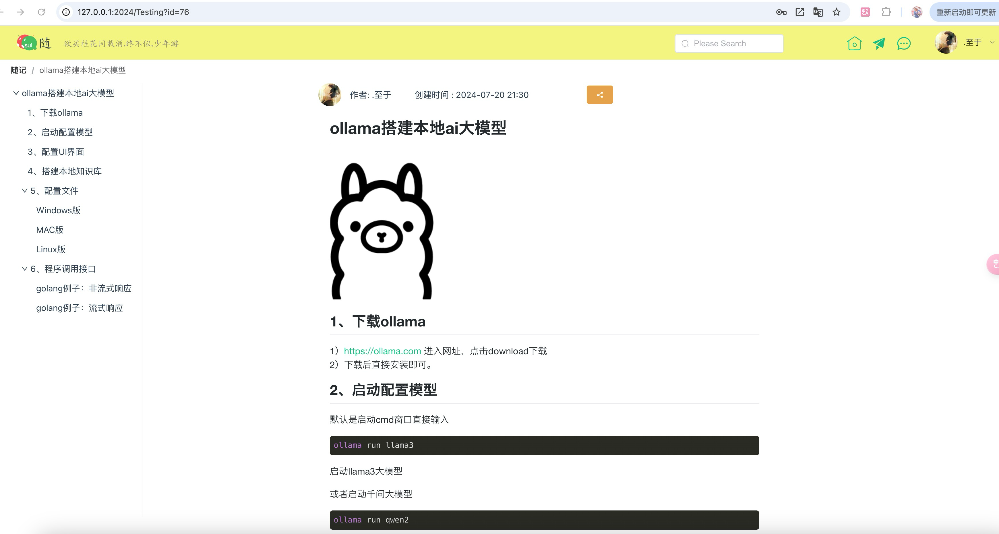
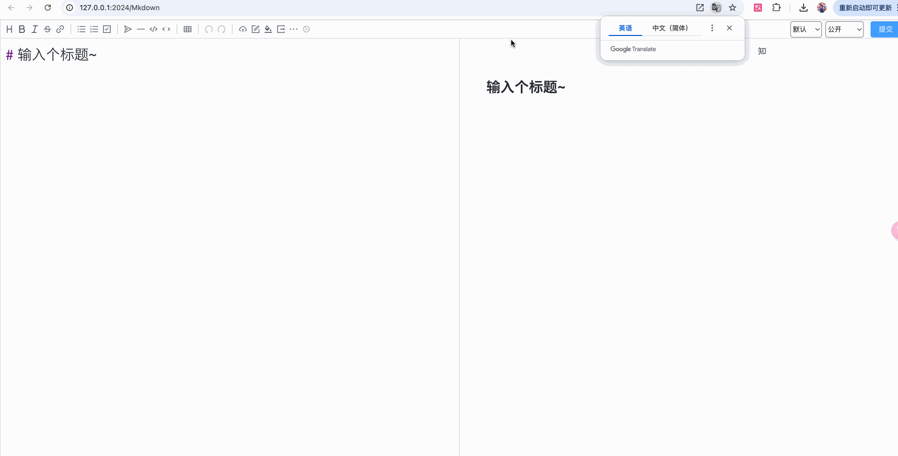
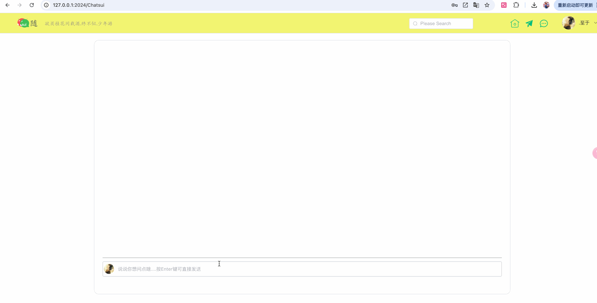

# SuiGo

#### 介绍
一款由Golang+Vue开发的博客类网站，支持大模型对话编写博客，同时适配PC和移动端，不过PC端最佳。

#### 软件架构
软件架构说明
本项目主要就是前后端分离。
1.  项目主要后端【go-suiapi】：Golang+Gin框架+Gorm
2.  项目数据库：Mysql+Redis
3.  项目前端【vuesui】：Vue+Vditor
4.  接入大语言模型AI，ollama部署所需的模型，具体部署方式可参考[ollama搭建本地ai大模型并应用调用](https://www.cnblogs.com/ggtop/p/18368333) 

#### 安装教程

1.  运行环境
    确定可以运行Golang项目、Vue项目、还有Mysql数据库、Redis
2.  将后端项目中的【suigo.sql】脚本导入到Mysql数据库中。
3.  将后端项目中conf\app.ini文件中的[database]中的（Mysql的配置HOST和PASSWORD）、（Redis的配置RDBHOST、RDBPWD）配置下
4.  再在go-suiapi项目中，直接编译项目go build或者直接go run main.go（go run . 也可执行）
5.  出现接口信息，就是后端启动成功
6.  在vuesui项目中，直接输入npm run dev 直接启动项目。

#### 使用说明
前后端启动后，进入页面
1.  登录页面

2.  首页

3.  博客详情页面

4.  博客编写页面

5.  个人博客页面

编辑功能：

6.  随问功能，接入ai功能

7.  白板功能 （画图）

8.  读书功能 （阅读pdf文件）

9.  软件下载功能

